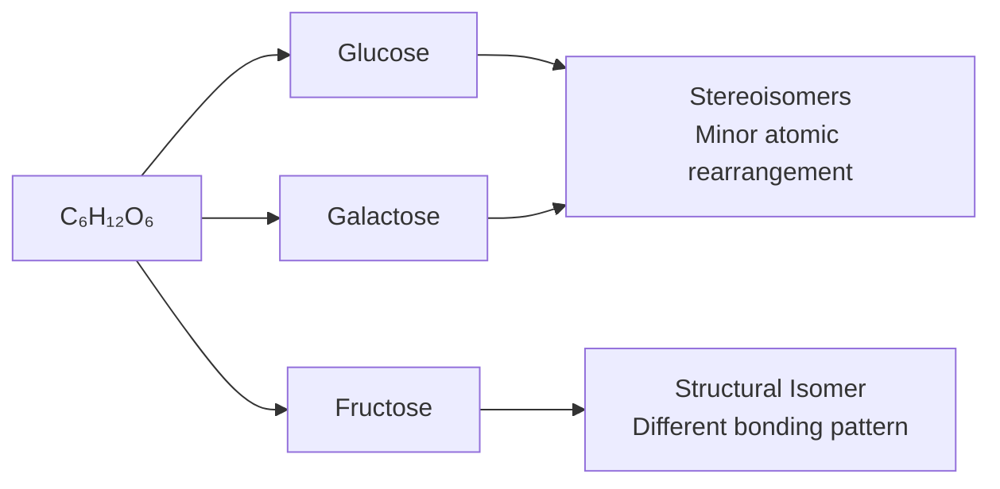

> [!success]- Definition
> Organic compounds primarily consisting of **Carbon, Hydrogen, and Oxygen** in a **1:2:1 ratio**.
> - Name origin: "carbo-" (carbon) + "-hydrate" (water)
> - When heated, sugars yield **carbon and water**
> - Classification: **Polyhydroxy aldehydes** OR **polyhydroxy ketones**

# Functions Overview

| Function                | Description                                        | Examples                                  |
| ----------------------- | -------------------------------------------------- | ----------------------------------------- |
| **Energy Source**       | Immediate energy when oxidized                     | Glucose in cellular respiration           |
| **Structural Support**  | Cell walls, exoskeletons                           | Cellulose in plants, Chitin in arthropods |
| **Molecular Transport** | Transport of sugars in organisms                   | Sucrose in plant sap, Glucose in blood    |
| **Storage**             | Energy storage for later use                       | Starch in plants, Glycogen in animals     |
| **Cell Recognition**    | Helps cells identify & communicate with each other | Glycolipids on cell surfaces              |

# Classification of Carbohydrates
## Simple Carbohydrates (sugars)
### Monosaccharides
#### Definition
- **General Formula**: Cn(H$_{2}0$)n; n = 3-7 carbon atoms (see[[#Classification (No. of Carbon atoms)]])
- Cannot be hydrolyzed into smaller sugar
#### Classification (No. of Carbon atoms)

| Name          | Carbon Atoms | Key Examples                             |
| ------------- | ------------ | ---------------------------------------- |
| Triose        | 3            | Glyceraldehyde, Dihydroxyacetone         |
| Tetrose       | 4            | (Rare in biology)                        |
| [[#^Pentose]] | 5            | see [[DNA, RNA, Genes]]                  |
| Hexose        | 6            | **Glucose**, **Fructose**, **Galactose** |
| Heptose       | 7            | (Less common)                            |

> [!info]- Glucose
> - Most important monosaccharide
> - Water-soluble—which makes it ideal for transport via **bloodstream**
> - All consumed sugars --> glucose via liver
> - Found in: sports drinks, blood

> [!info]- Fructose
> - **Sweetest** of all sugars
> - Found in: fruits, honey, corn syrup
> - Used as sweetener (needs less amount due to high sweetness)

> [!info]- Galactose
> - Combined with glucose to form **lactose** (milk sugar)
> - One of the three major hexoses
#### Isomerism

> [!question] What are Isomers?
> Molecules with the **same molecular formula** but **different arrangements of atoms**, leading to different properties.

##### Types of Isomers
1. **Structural Isomers** (Constitutional)
   - Atoms connected in **different orders**
   - Example: **Fructose vs. Glucose/Galactose**

2. **Stereoisomers**
   - Same atom connections, different **spatial arrangements**
   - Example: **Glucose vs. Galactose**
   - Differ at **asymmetric carbon** (C3 for glucose/galactose)

---

#### Ring Structures in Aqueous Solution

> [!IMPORTANT] **Pyranose Ring Formation**
> - In **aqueous solutions**, ~99% of hexoses exist as **ring conformations**
> - **6-membered ring** for most hexoses (glucose, galactose)
> - **5-membered ring** for fructose (despite being a hexose)

#### Alpha & Beta Glucose

> [!WARNING] DIFFERENCE
> The orientation of the **OH group at C1** determines polysaccharide structure:
> ![[alpha-beta-glucose-structure.png]]

### Oligosaccharides

#### Definition
- **"Oligo"** = few
- Consists of **2-10 monosaccharide units**
- Most common: **Disaccharides** (2 units)
#### Formation & Breakdown

> [!INFO] Condensation Reaction
> See [[Condensation & Hydrolysis#^condensation]]  
> **Products**: Disaccharide & Water
> **Bond formed**: Glycosidic bond (specifically O-glycosidic)
> ![[Condensation.png]]

>[!info] Hydrolysis
> See [[Condensation & Hydrolysis#^Hydrolysis]]  
> ![[Hydrolysis.png]]

#### Common Disaccharides

| Disaccharide  | Monomers                       | Type of Bond     | Source/Use                                  |
| ------------- | ------------------------------ | ---------------- | ------------------------------------------- |
| **Sucrose**   | Glucose + Fructose             | α-1,2-glycosidic | Plant sap transport, Sugarcane, Sugar beets |
| **Lactose**   | Glucose + Galactose            | β-1,4-glycosidic | Milk, dairy products                        |
| **Maltose**   | Glucose + Glucose              | α-1,4-glycosidic | Germinating seeds, Beer brewing             |
| **Raffinose** | Galactose + Glucose + Fructose | (Trisaccharide)  | Cabbage, beans, asparagus, grains           |
## Complex Carbohydrates (Polysaccharides)

### General Characteristics
- **"Poly"** = many
- **Hundreds to thousands** of monosaccharide monomers
- Insoluble in water (cannot pass through cell membrane without breakdown)
### Comparison of Major Polysaccharides
#### Summary

| Polysaccharide | Monomer                   | Bond Type                           | Branching                         | Function                          |
| -------------- | ------------------------- | ----------------------------------- | --------------------------------- | --------------------------------- |
| **Cellulose**  | **β-Glucose**             | 1-4                                 | **None** (straight chains)        | **Structural** (plant cell walls) |
| **Starch**     | **α-Glucose**             | Amylose: 1-4 Amylopectin: 1-4 & 1-6 | Amylose: no Amylopectin: yes      | **Storage** (plants)              |
| **Glycogen**   | **α-Glucose**             | 1-4 & 1-6                           | **Highly branched** (α-1,6 bonds) | **Storage** (animals/fungi)       |
| **Chitin**     | Glucose with **Nitrogen** | β-1,4-glycosidic                    | **None**                          | **Structural** (exoskeletons)     |
> [!info]- Cellulose
> - **Hydrogen bonds** lock chains into rigid bundles
> - **Humans cannot digest** (lack cellulase enzyme)
> - **Gut bacteria** in termites & grazers (cattle, sheep) digest it
> - **Dietary fiber**: reduces colon cancer risk by speeding food transit

> [!info]- Starch
> - **Primary storage polysaccharide in plants**
> - **Helical/coil shape** exposes bonds to hydrolytic enzymes
> - **Two forms**:
>   - **Amylose** (10-20%): unbranched, α-1,4 bonds
>   - **Amylopectin** (80-90%): branched (α-1,6 bonds every 24-30 units)
> - Sources: potatoes, rice, wheat (human dietary staples)

> [!info] Glycogen
> - **Rapid synthesis & breakdown** for energy homeostasis
> - **Hormone-regulated**:
>   - **Insulin** → promotes **glycogenesis** (storage)
>   - **Glucagon** → promotes **glycogenolysis** (breakdown)

> [!NOTE] **Nitrogen-containing Structural Polysaccharide**
> - **Second most common polysaccharide** in nature
> - Monomers: **glucose with nitrogen-containing carbonyl group**
> - **Unbranched chains** linked by hydrogen bonds
> - **Fungi cell walls** + **Arthropod exoskeletons** (insects, spiders, crustaceans)
> - **Application**: Surgical threads (toughness, flexibility, biodegradability)

# Carbohydrate Metabolism
## Key Metabolic Processes
> [!DEFINITION] **GLYCOLYSIS**
> - **Catabolic** breakdown of glucose
> - Generates **ATP** and **electron carriers** (NADH, FADH₂)
> - Occurs in **cytoplasm**
> - **Central pathway** for energy generation

> [!DEFINITION] **GLYCOGENESIS**
> - **Anabolic** synthesis of **glycogen** from excess glucose
> - Occurs in **liver and skeletal muscles**
> - Triggered by **insulin** (after eating)

> [!DEFINITION] **GLYCOGENOLYSIS**
> - **Catabolic** breakdown of glycogen → glucose subunits
> - Triggered by **glucagon** (during starvation/fasting)
> - Maintains **blood glucose levels**

> [!DEFINITION] **GLUconeogenesis**
> - **Anabolic** synthesis of **glucose from non-carbohydrate precursors**
> - Precursors: **lactate, amino acids, glycerol**
> - Occurs primarily in **liver**

> [!DEFINITION] **PENTose Phosphate Pathway**
> - Converts **hexoses → pentoses** (5-carbon sugars)
> - **Critical for nucleotide synthesis**
> - Produces **ribose** (RNA) and **deoxyribose** (DNA)

## Hormonal Control

| Hormone | Function | Process | Trigger |
|---------|----------|---------|---------|
| **Insulin** | **Lowers blood glucose** | Promotes **glycogenesis** | After eating (high glucose) |
| **Glucagon** | **Raises blood glucose** | Promotes **glycogenolysis** | Fasting/starvation (low glucose) |

| Class | Size | Solubility | Examples | Primary Function |
|-------|------|------------|----------|------------------|
| **Monosaccharide** | 1 unit | Soluble | Glucose, Fructose, Galactose, Ribose | Energy, nucleotide building blocks |
| **Disaccharide** | 2 units | Soluble | Sucrose, Lactose, Maltose | Energy transport (plants), digestion products |
| **Polysaccharide** | 100s-1000s | Insoluble | Cellulose, Starch, Glycogen, Chitin | Structural support, long-term energy storage |
